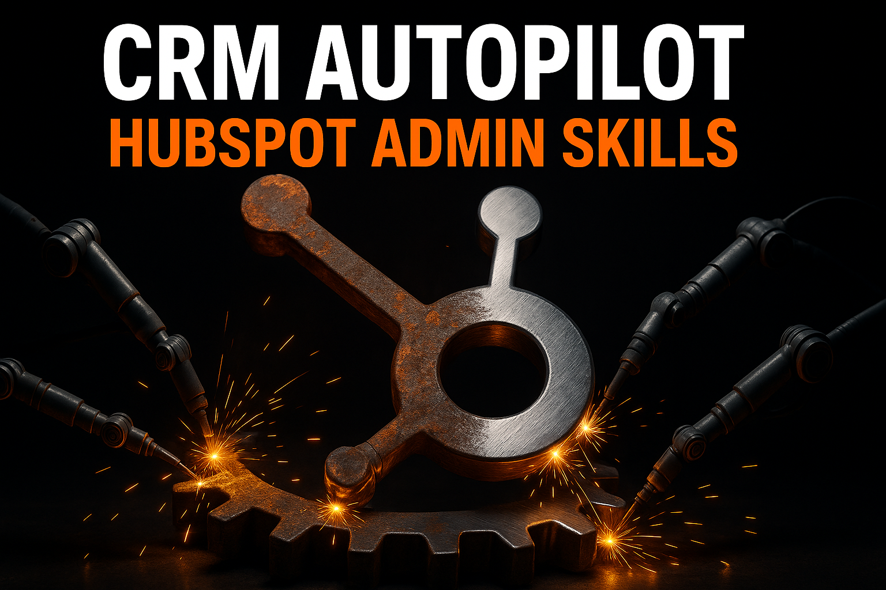

# HubSpot Admin Skills for Claude Code

<p align="center">
  
</p>

**30+ Claude Code skills for auditing, cleaning, enriching, and automating your HubSpot CRM**

[](./skills/)
[](./LICENSE)
[](https://claude.com/claude-code)

Built by [Tom Granot](https://consume.granot.io) — from deep experience with enterprise HubSpot CRM administration.

---

## Quick Start

### 1. Install

```bash
# Add the marketplace
/plugin marketplace add tomgranot/hubspot-admin-skills

# Install the plugin
/plugin install hubspot-admin@hubspot-admin-skills
```

Or clone directly: `git clone https://github.com/TomGranot/hubspot-admin-skills.git`

### 2. Audit your portal

```
/hubspot-audit
```

This scans your entire HubSpot portal — contacts, companies, deals, engagement, deliverability, data quality, duplicates, owners, lists, workflows — and produces a graded report. Each finding gets a severity rating (A-F) and is mapped to the specific skill that fixes it.

### 3. Get your cleanup plan

```
/hubspot-implementation-plan
```

Reads your audit report and generates a phased roadmap: what to fix, in what order, which skill to run, how long it takes, and what can be automated vs. what needs manual UI work. The plan sequences tasks by dependency — you can't score leads before enriching company data, and you can't build ICP tiers before standardizing industries.

### 4. Execute skill by skill

The plan tells you exactly which slash command to run next. Each skill follows a 4-stage pattern:

| Stage | What happens |
|-------|-------------|
| **Plan** | Explains the approach, asks you for any configuration needed |
| **Before** | Audits current state, exports CSV baseline, shows you what will change |
| **Execute** | Makes the changes (API scripts or step-by-step UI instructions) |
| **After** | Verifies the fix, compares before/after, confirms success |

Skills that can be scripted include ready-to-run Python scripts. Skills that require HubSpot UI work (workflows, lead scoring) provide precise build instructions — with options for HubSpot Breeze AI or the Claude Chrome extension.

### 5. Maintain

Once clean, use `/weekly-cleanup-routine` (5 min/week) and `/quarterly-database-cleanup` to keep it that way. The audit skill detects issues that no existing skill covers and offers to create new ones on the spot.

---

## Skills Reference

### Audit & Planning (2)

| Skill | Description |
|-------|-------------|
| `hubspot-audit` | Run a comprehensive audit of your HubSpot portal — contacts, companies, deals, properties, lists, workflows, and forms |
| `hubspot-implementation-plan` | Generate a phased implementation plan from audit findings with prioritized action items |

### Database Hygiene (6)

| Skill | Description |
|-------|-------------|
| `delete-no-email-contacts` | Identify and delete contacts that have no email address — unusable records that inflate your database |
| `suppress-hard-bounced` | Suppress contacts with hard-bounced email addresses to protect sender reputation |
| `suppress-global-unsubscribes` | Suppress globally unsubscribed contacts to ensure compliance and reduce wasted marketing spend |
| `suppress-ghost-contacts` | Find and suppress ghost contacts — records with no activity, no engagement, and no business value |
| `merge-duplicate-companies` | Detect and merge duplicate company records using domain matching and fuzzy name comparison |
| `reassign-deactivated-owners` | Reassign contacts and deals owned by deactivated HubSpot users to active team members |

### Data Enrichment (5)

| Skill | Description |
|-------|-------------|
| `enrich-company-name` | Populate missing company names on contacts by pulling from their associated company records |
| `enrich-industry` | Backfill contact industry values from associated company industry data |
| `standardize-geo-values` | Normalize country and state/region values to consistent formats across your database |
| `assign-unowned-contacts` | Assign marketing contacts that have no owner to the appropriate team members based on territory or segment rules |
| `fix-lifecycle-stages` | Detect and correct lifecycle stage violations — contacts stuck in the wrong stage or regressed backwards |

### Segmentation & Scoring (3)

| Skill | Description |
|-------|-------------|
| `create-icp-tiers` | Create an ICP (Ideal Customer Profile) tier property and assign tier values based on firmographic criteria |
| `build-lead-scoring` | Design and implement a lead scoring model using HubSpot's scoring properties and behavioral signals |
| `build-smart-lists` | Build active smart lists for key segments — ICP tiers, lifecycle stages, engagement levels, and suppression groups |

### Automation Workflows (4)

| Skill | Description |
|-------|-------------|
| `new-contact-hygiene-workflow` | Build a workflow that screens new contacts on creation — validates email, enriches data, and assigns owners |
| `engagement-suppression-workflow` | Create a workflow that automatically suppresses contacts after prolonged disengagement |
| `lifecycle-progression-workflow` | Set up automated lifecycle stage progression based on engagement thresholds and sales activity |
| `bounce-monitoring-workflow` | Build a workflow that monitors bounce events and auto-suppresses contacts exceeding bounce thresholds |

### Ongoing Maintenance (12)

| Skill | Description |
|-------|-------------|
| `quarterly-database-cleanup` | Run a quarterly hygiene sweep — re-audit contacts, prune stale records, and refresh suppression lists |
| `review-bounced-contacts` | Review contacts with 3+ bounces and decide on suppression or re-verification |
| `cleanup-lists` | Audit and archive unused, redundant, or stale lists cluttering your portal |
| `cleanup-forms` | Review forms for unused, broken, or duplicate entries and recommend consolidation |
| `cleanup-workflows` | Identify workflows that are off, broken, or redundant and recommend which to archive or fix |
| `weekly-cleanup-routine` | A repeatable weekly checklist covering the highest-impact maintenance tasks |
| `cleanup-dashboards` | Audit dashboards for unused, duplicate, or outdated reports and recommend consolidation |
| `cleanup-deals` | Review deal pipeline hygiene — stale deals, missing properties, and stage violations |
| `cleanup-properties` | Find unused, duplicate, or poorly named contact/company/deal properties and recommend cleanup |
| `cleanup-lead-owners` | Audit lead owner assignments for imbalances, orphaned records, and routing issues |
| `backfill-geo-data` | Backfill missing country and state values using IP geolocation, form submissions, and company data |
| `create-segment-lists` | Create a standard set of segment lists for reporting, targeting, and suppression |

---

## Prerequisites

- **Claude Code** installed and configured
- **HubSpot account** with API access (private app token with appropriate scopes)
- **Python 3.10+** with [uv](https://github.com/astral-sh/uv) for scripted processes
- HubSpot **Marketing Professional** plan or higher (for workflow-based skills)

---

## Directory Structure

```
hubspot-admin-skills/
├── README.md
├── CLAUDE.md
├── LICENSE
├── .gitignore
├── assets/
│   └── hero.png
├── .claude-plugin/
│   ├── marketplace.json
│   └── plugin.json
└── skills/
    ├── hubspot-audit/
    │   └── SKILL.md
    ├── hubspot-implementation-plan/
    │   └── SKILL.md
    ├── delete-no-email-contacts/
    │   ├── SKILL.md
    │   └── scripts/
    │       ├── before.py
    │       ├── execute.py
    │       └── after.py
    ├── suppress-hard-bounced/
    │   ├── SKILL.md
    │   └── scripts/
    │       ├── before.py
    │       └── after.py
    ├── ...                        (32 skills total, 13 with scripts)
    └── backfill-geo-data/
        └── SKILL.md
```

---

## Where to Get It

| Source | Link |
|--------|------|
| Claude Code Plugin Marketplace | `/plugin marketplace add tomgranot/hubspot-admin-skills` |
| ClawHub | [clawhub.ai](https://clawhub.ai) |
| awesome-claude-skills | Listed in the HubSpot / CRM category |
| SkillsMP | [skillsmp.com](https://skillsmp.com) |

---

## Community-Driven: Help Build the Skill Set

Every HubSpot portal is different. The audit skill will automatically detect issues that aren't covered by existing skills and **offer to create new ones on the spot**. When it does, it will ask:

> *"Would you like to contribute this new skill back to the community? It will help other HubSpot admins facing the same issue."*

If you say yes, Claude Code will create the skill, push it to your fork, and open a PR — all automatically. You don't need to know git or write markdown.

### Manual Contributing

If you prefer to contribute manually:

1. **Fork**: `gh repo fork tomgranot/hubspot-admin-skills --clone`
2. **Branch**: `git checkout -b skill/your-skill-name`
3. **Create**: Add `skills/<your-skill>/SKILL.md` following the existing format:
   - YAML frontmatter: `name`, `description`, `license`, `metadata` (author, version, category)
   - 4-stage execution pattern: **Plan** → **Before State** → **Execute** → **After State**
   - API code examples using `hubspot-api-client` where applicable
   - Safety mechanisms (thresholds, CSV exports, confirmation prompts)
   - Rollback instructions
4. **Test**: Run the skill against a HubSpot sandbox portal
5. **PR**: `gh pr create --repo tomgranot/hubspot-admin-skills`

### Skill Categories

When creating a skill, assign it to one of these categories in the `metadata.category` field:

| Category | Slug | Description |
|----------|------|-------------|
| Audit & Planning | `audit-planning` | Portal assessment and implementation planning |
| Database Hygiene | `database-hygiene` | Removing bad data, suppressing contacts, deduplication |
| Data Enrichment | `data-enrichment` | Filling gaps in contact/company data |
| Segmentation & Scoring | `segmentation-scoring` | ICP tiers, lead scoring, smart lists |
| Automation Workflows | `automation-workflows` | HubSpot workflows for ongoing hygiene |
| Ongoing Maintenance | `ongoing-maintenance` | Recurring cleanup and health checks |

Please keep skills generic and company-agnostic. No customer data, API keys, or proprietary information.

---

## Author

Created by **[Tom Granot](https://consume.granot.io)**. Built from extensive experience administering HubSpot CRM at scale.

---

## License

MIT -- see [LICENSE](./LICENSE) for details.
